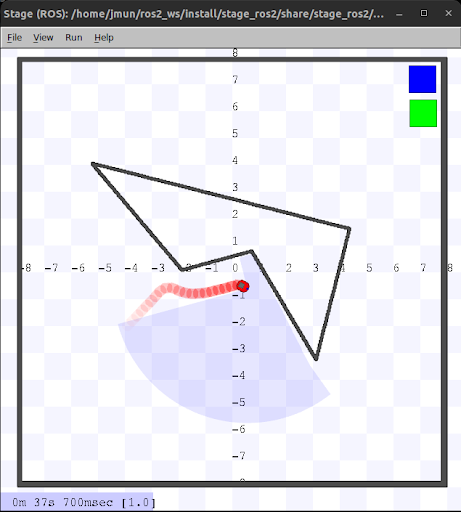

# PID Controller Robot (Aug 2025 - Dec 2025)

## Overview
This project implements a **PID controller for obstacle avoidance** in a robot simulated with **ROS2 and Stage**. The robot uses laser scan data to detect obstacles and applies a PID control loop to adjust its angular velocity, keeping a safe clearance while moving forward.

See the [addon](https://github.com/JMunoz610/LidarBot) to this project using ROS2 and Gazebo instead of stage.

---

## Goal
The main goal of this project is to:
- Demonstrate how a **PID controller** can be applied to robot navigation.
- Enable the robot to move forward while dynamically adjusting its heading to avoid obstacles.
- Provide a reproducible ROS2 + Stage setup for testing PID-based control strategies.

---

## How It Works
- **Laser Scan Processing**:
  - Subscribes to the `base_scan` topic (Stage simulator).
  - Identifies the closest obstacle within a defined scan window.
- **PID Control Loop**:
  - Computes heading error based on obstacle position.
  - Applies proportional (P), integral (I), and derivative (D) terms to adjust angular velocity.
  - Publishes velocity commands (`cmd_vel`) to steer the robot.
- **Odometry Integration**:
  - Subscribes to `ground_truth` for robot pose.
  - Updates internal state for heading and position.

---



## Usage

1. Build your ROS2 workspace
   ```bash
   colcon build
   source install/setup.bash
2. Run Stage Environment
   ```bash
   ros2 launch stage_ros2 demo.launch.py world:=cave_multi
3. Run Python code
   ```bash
   python3 pid_controller.py

